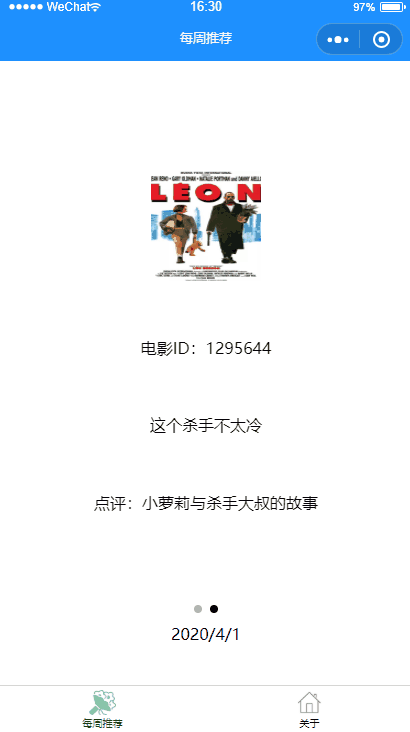
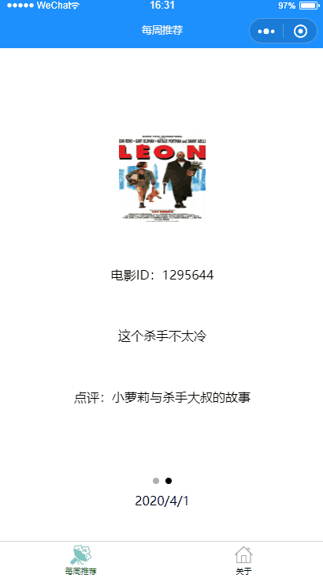
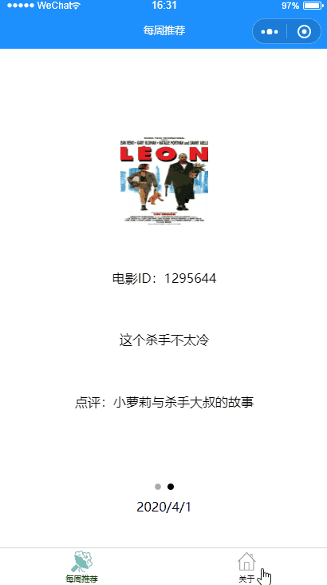

## 电影周周看——适合新手学习的微信小程序
一个极其适合新手学习的微信小程序——电影周周看。在这里你可以学习到小程序开发的基本流程和基本方法，麻雀虽小，五脏俱全。搭配学堂在线的教学视频食用更佳！针对教学视频中豆瓣API不可使用的问题，我使用了豆瓣API的代理服务解决。

 **学堂在线教学视频：[http://www.xuetangx.com/courses/course-v1:TsinghuaX+2018032801X+2018_T1/about](http://www.xuetangx.com/courses/course-v1:TsinghuaX+2018032801X+2018_T1/about)**
 
 **我的GitHub主页：[https://github.com/VenomMGF](https://github.com/VenomMGF)**

 **我的CSDN主页：https://me.csdn.net/weixin_43829992](https://me.csdn.net/weixin_43829992)**

 **欢迎交流学习和Star支持，如使用过程中碰到问题，可以提出Issue或在CSDN给我留言，我一定尽力完善**
## 小程序介绍
-----------------------------------
一个每周推荐好电影的微信小程序，你可以在每周推荐中选择自己的喜欢的电影，点击可以查看电影更详细的信息，并将页面内容分享给好友。是一个涵盖了微信小程序开发基本技术的纯学习型项目。

## 项目结构
```lua

电影周周看
├── weekly  -- 每周推荐页面
│
├── detail -- 推荐电影的详情页面
│
├── about -- 关于页面

```

## 你将学习到以下内容
- 基础组件：`view`、`text`、`image`、`swiper`、`navigator`
- 条件渲染和列表渲染：`wx.if`、`we.for`
- 页面的生命周期函数：`OnLoad等`
- 数据绑定方法
- 更新数据方法
- 事件机制
- 发起请求API：`wx.request`
- 动态设置导航栏
- 页面事件处理函数

## API说明
自2018年5月以来豆瓣API文档已经不再开放，在此使用一个豆瓣 API 的代理服务，旨在帮助各位初学者解决豆瓣屏蔽小程序请求问题（豆瓣接口 403 问题），2020/4/3依然可用
地址：https://douban.uieee.com/


## 演示效果图
|  |  | | |
